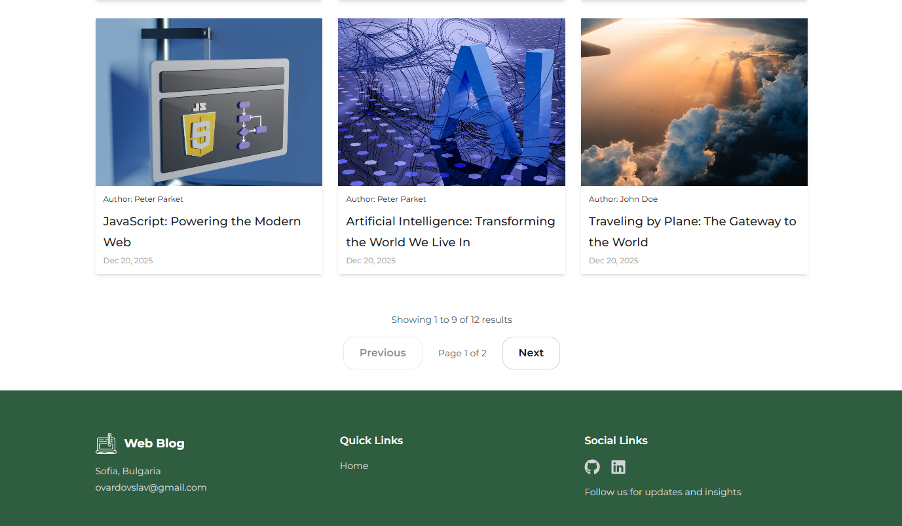
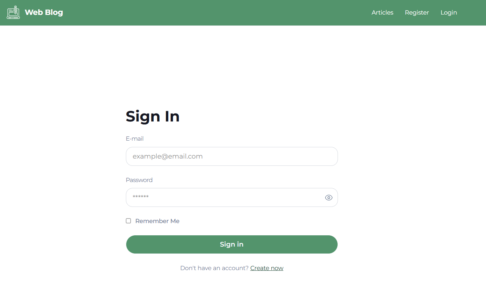
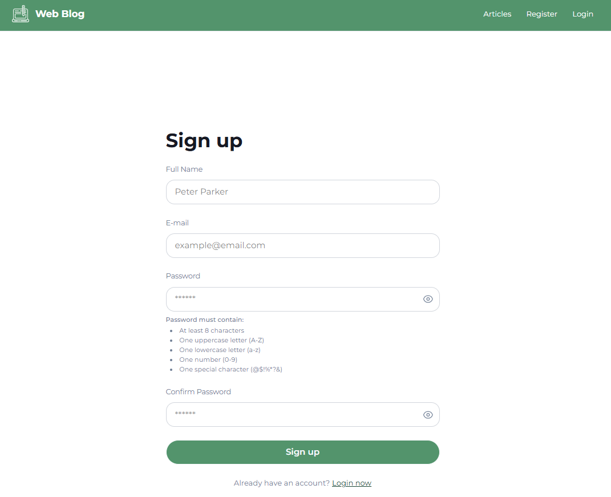
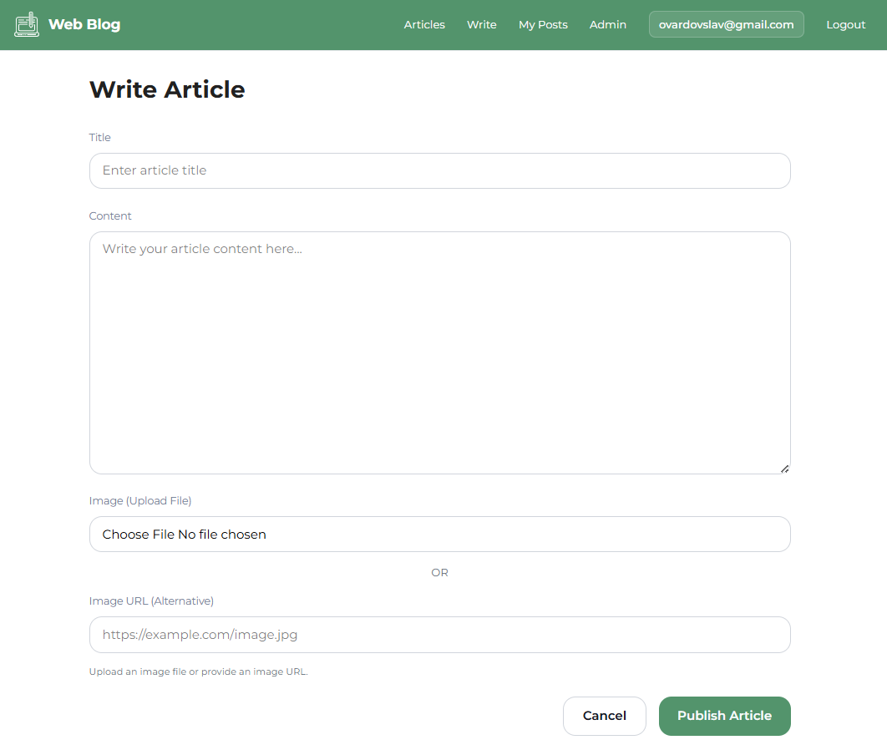
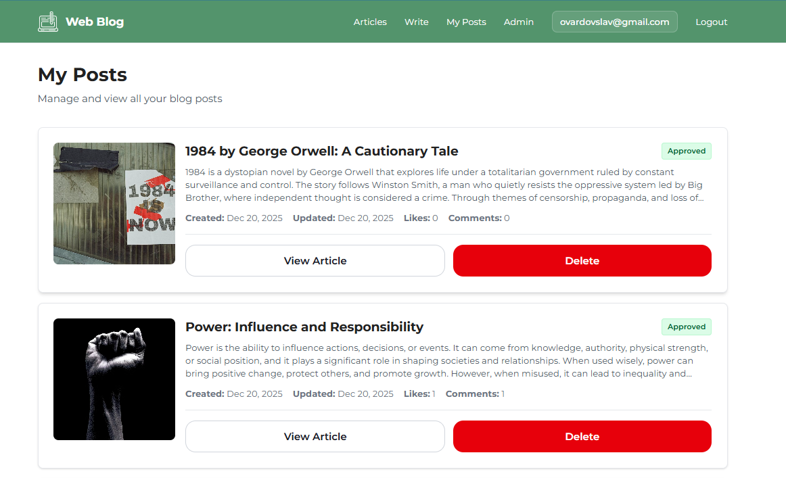
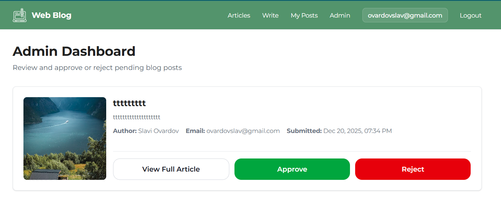

# Web Blog Application

<details open>
<summary><h3>1. Project Overview</h3></summary>

<details open>
<summary><h4>1.1. Brief Description</h4></summary>

A **Single Page Application (SPA)** built with React.js that serves as a comprehensive blogging platform. The application provides both public content access and authenticated user areas with social interaction features.

### Key Features

- **User Management**: Public and private user areas with role-based access control
- **Content Management**: Full CRUD operations for blog posts with moderation system
- **Social Features**: Likes, dislikes, comments, and user interactions
- **Modern UI/UX**: Responsive design using Tailwind CSS with loading indicators and smooth transitions
- **Cloud Integration**: Cloudinary API integration for image storage
- **Deployment**: Production-ready deployment on Netlify (frontend) and Render (backend)
- **Quality Assurance**: Unit tests for components, hooks, and utilities using Vitest and React Testing Library
- **API Documentation**: Interactive Swagger/OpenAPI documentation for all endpoints
- **Additional Features**: Pagination, reusable UI components, "Remember Me" functionality, and admin moderation dashboard

### Technical Implementation

| Component                  | Implementation Details                                                                            |
| -------------------------- | ------------------------------------------------------------------------------------------------- |
| **Architecture & Routing** | Client-side routing with 5+ dynamic pages, parameterized routes, and route guards                 |
| **State Management**       | Context API for global authentication state, useState for local component state                   |
| **React Hooks**            | useState, useEffect, useCallback, useRef, useContext for component lifecycle and state management |
| **Component Lifecycle**    | useEffect hooks for mount, update, and unmount with cleanup functions                             |
| **Forms**                  | Controlled forms with custom useControllerForm hook, validation, and error handling               |
| **Synthetic Events**       | onClick, onChange, onSubmit throughout the application                                            |
| **Route Protection**       | Triple guard system (AuthGuard, GuestGuard, AdminGuard) for secure route access                   |
| **Error Handling**         | Global error handling with user-friendly error messages and network error utilities               |

### Project Context

Developed as part of a **React.js course project**, this platform enhances the blogging experience by offering a user-friendly interface with comprehensive social features and admin moderation capabilities.

**Live Application**:

- **Frontend**: [https://ovardov99-web-blog.netlify.app](https://ovardov99-web-blog.netlify.app)
- **Backend API**: [https://ovardov99-web-blog-api.onrender.com](https://ovardov99-web-blog-api.onrender.com)
- **API Documentation**: [https://ovardov99-web-blog-api.onrender.com/api-docs](https://ovardov99-web-blog-api.onrender.com/api-docs)

### Application Preview


_Hero banner section on the home page_


_Home page displaying the latest blog posts with pagination_


_Popular/trending posts section_


_Application footer_


_Individual blog post detail page with comments and likes_


_User login page with authentication form_


_User registration page_


_Create new blog post page with image upload_


_User's personal blog posts dashboard showing all their created posts_


_Admin dashboard for moderating blog posts_

</details>

<details>
<summary><h4>1.2. Main Features/Functionalities</h4></summary>

<details>
<summary><h5>1.2.1. User Management</h5></summary>

- User registration and authentication with JWT tokens
- Secure password hashing with bcrypt
- "Remember Me" functionality for extended sessions (30 days vs 1 day)
- Profile information display (email in navigation)
- Session management using HTTP-only cookies and localStorage fallback
- Automatic token refresh mechanism
</details>

<details>
<summary><h5>1.2.2. Blog Features</h5></summary>

- Create, Read, Update, and Delete posts (CRUD operations)
- Social interactions: likes, dislikes, and comments
- Public post catalog with pagination
- Detailed post views with author information
- Image upload and management via Cloudinary API
- Blog moderation system (pending/approved/rejected status)
- User's personal blog dashboard
</details>

<details>
<summary><h5>1.2.3. Core Platform Features</h5></summary>

- **Authentication & Authorization**
  - Secure JWT-based authentication with access and refresh tokens
  - Session management using HTTP-only cookies
  - Role-based access control (RBAC) with admin privileges
- **Security & Performance**

  - Rate limiting on authentication endpoints
  - Route guards for protected areas
  - Public/private area separation
  - CORS protection
  - Helmet.js for security headers
  - XSS and CSRF protection

- **User Roles & Permissions**

  | Role                   | Description                                                                                                                                      |
  | ---------------------- | ------------------------------------------------------------------------------------------------------------------------------------------------ |
  | **Guest**              | • View blog posts and detailed post views<br>• Register and login<br>• No posting or interaction capabilities                                    |
  | **Authenticated User** | • All guest permissions, plus:<br>• Full CRUD operations on own posts<br>• Like, dislike, and comment on posts<br>• View personal blog dashboard |
  | **Admin**              | • All user permissions, plus:<br>• Access admin dashboard<br>• Approve/reject pending blog posts<br>• View all pending blogs                     |

- **RESTful API Architecture**

  | Component       | Description                                                                                                                                             |
  | --------------- | ------------------------------------------------------------------------------------------------------------------------------------------------------- |
  | API Base URL    | Development: `http://localhost:5000`<br>Production: `https://ovardov99-web-blog-api.onrender.com`                                                       |
  | Authentication  | JWT-based with HTTP-only cookies for refresh tokens                                                                                                     |
  | Request Format  | JSON (multipart/form-data for file uploads)                                                                                                             |
  | Response Format | JSON                                                                                                                                                    |
  | HTTP Methods    | • GET: Retrieve resources<br>• POST: Create new resources<br>• PUT: Update existing resources<br>• DELETE: Remove resources<br>• PATCH: Partial updates |
  | Status Codes    | • 200: Success<br>• 201: Created<br>• 400: Bad Request<br>• 401: Unauthorized<br>• 403: Forbidden<br>• 404: Not Found<br>• 500: Internal Server Error   |
  | Rate Limiting   | Applied to authentication endpoints                                                                                                                     |
  | Documentation   | Interactive Swagger/OpenAPI documentation available at `/api-docs`                                                                                      |

- **Pagination:**
  - **Request Parameters:**
    - `page` (optional): Page number, defaults to 1
    - `limit` (optional): Items per page, defaults to 9
    - `sortBy` (optional): Sort field, defaults to "createdAt"
    </details>
    </details>

<details open>
<summary><h4>1.3. Technical Stack (MERN)</h4></summary>

- **MongoDB**: NoSQL database for flexible data storage and blog content management
- **Express.js**: Backend web application framework with middleware support
- **React.js v19**: Frontend library for building the single-page application
- **Node.js**: Server-side JavaScript runtime environment

**Additional Technologies:**

- **Frontend Libraries:**

  - **React Router v7**: Client-side routing and navigation
  - **Vite**: Build tool and development server
  - **Tailwind CSS**: Utility-first CSS framework for responsive design
  - **Vitest**: Unit testing framework
  - **React Testing Library**: Component testing utilities

- **Backend Libraries:**
  - **Mongoose**: MongoDB object modeling tool
  - **JWT (jsonwebtoken)**: JSON Web Tokens for secure authentication
  - **bcrypt**: Password hashing for secure user authentication
  - **cookie-parser**: Cookie parsing middleware for session management
  - **express-rate-limit**: Rate limiting middleware for API protection
  - **express-validator**: Input validation and sanitization
  - **Cloudinary**: Image storage and management service
  - **CORS**: Cross-Origin Resource Sharing configuration
  - **Helmet**: Security headers middleware
  - **Swagger/OpenAPI**: API documentation with interactive UI
  </details>
  </details>

<details open>
<summary><h3>2. Project Architecture</h3></summary>

<details open>
<summary><h4>2.1. Structure Overview</h4></summary>

**2.1.1. React Architecture Components**

This application follows a component-based architecture with clear separation of concerns:

- **pages/** - Top-level route components that represent different views of the application
- **components/** - Reusable UI building blocks organized by feature (blog, navigation, ui)
- **layouts/** - Layout wrappers that provide consistent structure across pages
- **services/** - API communication layer that handles all HTTP requests to the backend
- **contexts/** - React Context providers for global state management (AuthContext)
- **hooks/** - Custom React hooks for reusable logic (useAuth, useControllerForm)
- **utils/** - Utility functions for date formatting, error handling, and token management
- **guards/** - Route protection components (AuthGuard, GuestGuard, AdminGuard)
- **config/** - Configuration files for API endpoints and environment settings

**2.1.2. Node.js Backend Architecture**

- **config/** - Contains configuration files for database, CORS, routes, and Swagger
- **controllers/** - Handles HTTP requests and response logic
- **middlewares/** - Contains middleware functions for authentication, validation, error handling, rate limiting, and file uploads
- **models/** - Defines data models and schema using Mongoose (User, Blog)
- **services/** - Contains business logic and data processing
- **utils/** - Utility functions for token management, logging, and graceful shutdown
- **validations/** - Input validation schemas using express-validator
</details>

<details>
<summary><h4>2.2. Directory Structure</h4></summary>

```
Web-Blog/
├── api/                    # Backend (Node.js/Express)
│   ├── src/
│   │   ├── config/         # Configuration files
│   │   │   ├── cors.js
│   │   │   ├── database.js
│   │   │   ├── routes.js
│   │   │   ├── envValidation.js
│   │   │   └── swagger.js
│   │   ├── controllers/    # Route controllers
│   │   │   ├── adminController.js
│   │   │   ├── blogController.js
│   │   │   ├── userController.js
│   │   │   └── healthController.js
│   │   ├── middlewares/    # Express middlewares
│   │   │   ├── authMiddleware.js
│   │   │   ├── adminMiddleware.js
│   │   │   ├── errorMiddleware.js
│   │   │   ├── validateMiddleware.js
│   │   │   ├── timeoutMiddleware.js
│   │   │   ├── uploadMiddleware.js
│   │   │   └── rateLimiters/
│   │   │       ├── authRateLimiter.js
│   │   │       ├── globalRateLimiter.js
│   │   │       └── refreshRateLimiter.js
│   │   ├── models/         # Mongoose models
│   │   │   ├── Blog.js
│   │   │   └── User.js
│   │   ├── services/       # Business logic
│   │   │   ├── blogService.js
│   │   │   ├── userService.js
│   │   │   └── healthService.js
│   │   ├── utils/          # Utility functions
│   │   │   ├── tokenUtils.js
│   │   │   ├── logger.js
│   │   │   ├── AppError.js
│   │   │   └── gracefulShutdown.js
│   │   └── validations/    # Input validation schemas
│   │       ├── blogValidation.js
│   │       └── userValidation.js
│   ├── package.json
│   └── generateJWTSecret.js
│
└── client/                 # Frontend (React)
    ├── src/
    │   ├── components/      # React components
    │   │   ├── blog/       # Blog-specific components
    │   │   │   ├── BannerCard.jsx
    │   │   │   ├── LatestPosts.jsx
    │   │   │   ├── PopularPosts.jsx
    │   │   │   └── PostHeader.jsx
    │   │   ├── guards/     # Route guards
    │   │   │   ├── AuthGuard.jsx
    │   │   │   ├── GuestGuard.jsx
    │   │   │   └── AdminGuard.jsx
    │   │   ├── navigation/  # Navigation components
    │   │   │   └── Navigation.jsx
    │   │   └── ui/         # Reusable UI components
    │   │       ├── ArticleCard.jsx
    │   │       ├── ArticleGrid.jsx
    │   │       ├── BlogCard.jsx
    │   │       ├── Button.jsx
    │   │       ├── InputField.jsx
    │   │       ├── PasswordField.jsx
    │   │       ├── TextareaField.jsx
    │   │       ├── Pagination.jsx
    │   │       ├── LoadingScreen.jsx
    │   │       ├── HeaderLogo.jsx
    │   │       ├── ListItem.jsx
    │   │       └── HamburgerLine.jsx
    │   ├── contexts/       # React Context providers
    │   │   ├── AuthContext.jsx
    │   │   └── authContextValue.js
    │   ├── hooks/          # Custom React hooks
    │   │   ├── useAuth.js
    │   │   └── useControllerForm.js
    │   ├── layouts/        # Layout components
    │   │   ├── BlogLayout.jsx
    │   │   ├── AuthLayout.jsx
    │   │   └── ContainerLayout.jsx
    │   ├── pages/          # Page components
    │   │   ├── auth/       # Authentication pages
    │   │   │   ├── Login.jsx
    │   │   │   ├── Register.jsx
    │   │   │   └── Logout.jsx
    │   │   ├── BlogDetail.jsx
    │   │   ├── Write.jsx
    │   │   ├── Edit.jsx
    │   │   ├── MyPosts.jsx
    │   │   ├── AdminDashboard.jsx
    │   │   └── NotFound.jsx
    │   ├── services/       # API service functions
    │   │   ├── authService.js
    │   │   ├── blogService.js
    │   │   └── adminService.js
    │   ├── utils/         # Utility functions
    │   │   ├── tokenUtils.js
    │   │   ├── dateUtils.js
    │   │   └── errorUtils.js
    │   ├── styles/        # CSS files
    │   │   └── global.css
    │   ├── config/        # Configuration
    │   │   └── apiConfig.js
    │   ├── test/          # Test setup
    │   │   └── setup.js
    │   ├── App.jsx        # Main app component
    │   └── main.jsx       # Entry point
    ├── public/
    │   └── logo.svg
    ├── package.json
    ├── vite.config.js
    └── README.md
```

</details>
</details>

<details>
<summary><h3>3. API Documentation</h3></summary>

<details>
<summary><h4>3.1. Introduction</h4></summary>

The API is organized around REST principles. This API has predictable resource-oriented URLs, accepts JSON-encoded request bodies (and multipart/form-data for file uploads), returns JSON-encoded responses, and uses standard HTTP response codes and JWT-based authentication.

**Interactive Documentation**: Access the Swagger UI at:

- **Development**: `http://localhost:5000/api-docs`
- **Production**: `https://ovardov99-web-blog-api.onrender.com/api-docs`
</details>

<details>
<summary><h4>3.2. Base URL</h4></summary>

All endpoints are prefixed with "/api/v1".

- **Development**: `http://localhost:5000/api/v1`
- **Production**: `https://ovardov99-web-blog-api.onrender.com/api/v1`
</details>

<details>
<summary><h4>3.3. HTTP Methods</h4></summary>

The API uses standard HTTP methods for different operations:

- `GET` - Retrieve resources
- `POST` - Create new resources
- `PUT` - Update existing resources (full update)
- `PATCH` - Partial updates to resources
- `DELETE` - Remove resources

</details>

<details>
<summary><h4>3.4. Authentication</h4></summary>

Most endpoints require authentication using JWT Bearer tokens. Include the access token in the Authorization header:

```
Authorization: Bearer <access_token>
```

Refresh tokens are stored in HTTP-only cookies and are used automatically for token refresh.

</details>

<details>
<summary><h4>3.5. Response Codes</h4></summary>

**Code:** `200 OK`  
Returns the requested data successfully.

**Code:** `201 Created`  
Resource created successfully.

**Code:** `204 No Content`  
Resource deleted successfully.

**Code:** `400 Bad Request`  
Returned if the request is invalid or validation fails.

**Code:** `401 Unauthorized`  
Returned if the user is not authenticated or token is invalid.

**Code:** `403 Forbidden`  
Returned if the user doesn't have permission to access the resource.

**Code:** `404 Not Found`  
Returned if the resource does not exist.

**Code:** `500 Internal Server Error`  
The server encountered an unexpected condition that prevented it from fulfilling the request.

</details>

<details>
<summary><h4>3.6. Endpoints Overview</h4></summary>

### Authentication Endpoints

| Method | Endpoint         | Description          | Auth Required |
| ------ | ---------------- | -------------------- | ------------- |
| POST   | `/auth/register` | Register a new user  | No            |
| POST   | `/auth/login`    | Login user           | No            |
| POST   | `/auth/logout`   | Logout user          | Yes           |
| POST   | `/auth/refresh`  | Refresh access token | No (cookie)   |

### Blog Endpoints

| Method | Endpoint               | Description             | Auth Required |
| ------ | ---------------------- | ----------------------- | ------------- |
| GET    | `/blogs`               | Get all blogs (catalog) | No            |
| GET    | `/blogs/:id`           | Get blog by ID          | Optional      |
| POST   | `/blogs`               | Create a new blog post  | Yes           |
| PUT    | `/blogs/:id`           | Update a blog post      | Yes (author)  |
| DELETE | `/blogs/:id`           | Delete a blog post      | Yes (author)  |
| POST   | `/blogs/:id/like`      | Like a blog post        | Yes           |
| POST   | `/blogs/:id/dislike`   | Dislike a blog post     | Yes           |
| POST   | `/blogs/:id/comments`  | Add a comment           | Yes           |
| GET    | `/blogs/user/my-blogs` | Get user's blog posts   | Yes           |

### Admin Endpoints

| Method | Endpoint                  | Description           | Auth Required |
| ------ | ------------------------- | --------------------- | ------------- |
| GET    | `/admin/pending-blogs`    | Get all pending blogs | Yes (admin)   |
| PATCH  | `/admin/blogs/:id/status` | Update blog status    | Yes (admin)   |

</details>

<details>
<summary><h4>3.7. Interactive API Documentation</h4></summary>

For detailed API documentation with request/response examples, authentication testing, and interactive endpoint exploration, visit the Swagger UI:

- **Development**: [http://localhost:5000/api-docs](http://localhost:5000/api-docs)
- **Production**: [https://ovardov99-web-blog-api.onrender.com/api-docs](https://ovardov99-web-blog-api.onrender.com/api-docs)
</details>
</details>

<details open>
<summary><h3>4. Environment Setup</h3></summary>

<details>
<summary><h4>4.1. Prerequisites</h4></summary>

- Node.js (v18 or higher)
- MongoDB installed and running locally, or a MongoDB Atlas account
- npm or yarn package manager
- Cloudinary account (for image storage)
</details>

<details>
<summary><h4>4.2. Installation Steps</h4></summary>

1. Clone the repository

   ```bash
   git clone <repository-url>
   cd Web-Blog
   ```

2. Install backend dependencies

   ```bash
   cd api
   npm install
   cd ..
   ```

3. Install frontend dependencies

   ```bash
   cd client
   npm install
   cd ..
   ```

4. Create Environment Variables

<details>
<summary><h5>4.2.1. Backend Configuration (api/.env)</h5></summary>

```env
NODE_ENV=development
PORT=5000
MONGODB_URI=your_mongodb_connection_string
JWT_SECRET=your_jwt_secret_key
BCRYPT_SALT_ROUNDS=12
CLOUDINARY_CLOUD_NAME=your_cloudinary_name
CLOUDINARY_API_KEY=your_cloudinary_key
CLOUDINARY_API_SECRET=your_cloudinary_secret
FRONTEND_URL=http://localhost:5173
COOKIE_DOMAIN=
```

**Note**: You can generate a JWT secret using:

```bash
cd api
npm run generate-token
```

</details>

<details>
<summary><h5>4.2.2. Frontend Configuration (client/.env)</h5></summary>

```env
VITE_API_URL=http://localhost:5000
```

**Note**: This is optional. The application auto-detects the API URL based on the environment.

</details>
</details>

<details>
<summary><h4>4.3. Available Scripts</h4></summary>

**Backend Scripts (from api/ directory):**

- Start the server in production mode: `npm start`
- Start the server in development mode: `npm run dev`
- Generate JWT secret: `npm run generate-token`

**Frontend Scripts (from client/ directory):**

- Start development server: `npm run dev`
- Build for production: `npm run build`
- Preview production build: `npm run preview`
- Run unit tests: `npm test`
- Run tests with UI: `npm run test:ui`
- Generate coverage report: `npm run test:coverage`
- Run ESLint: `npm run lint`

**Development Workflow:**

1. Start backend server:

   ```bash
   cd api
   npm run dev
   ```

   Backend will run on `http://localhost:5000`

2. Start frontend server (in a new terminal):
   ```bash
   cd client
   npm run dev
   ```
   Frontend will run on `http://localhost:5173`

</details>
</details>

<details>
<summary><h4>4.4. Dependencies Overview</h4></summary>

<details>
<summary><h5>4.4.1. Main Dependencies</h5></summary>

**Frontend (client/)**

- `react`: React library (v19.2.0)
- `react-router-dom`: Client-side routing (v7.10.1)
- `vite`: Build tool and dev server (v7.2.2)
- `tailwindcss`: Utility-first CSS framework (v4.1.17)

**Backend (api/)**

- `express`: Web framework (v5.2.1)
- `mongoose`: MongoDB object modeling (v9.0.1)
- `jsonwebtoken`: JWT implementation for authentication (v9.0.3)
- `bcrypt`: Password hashing (v6.0.0)
- `dotenv`: Environment variables management (v17.2.3)
- `express-validator`: Input validation middleware (v7.3.1)
- `cloudinary`: Image storage service (v2.8.0)
- `cookie-parser`: Cookie parsing middleware (v1.4.7)
- `cors`: Cross-Origin Resource Sharing (v2.8.5)
- `helmet`: Security headers middleware (v8.1.0)
- `express-rate-limit`: Rate limiting middleware (v8.2.1)
- `multer`: File upload handling (v1.4.5-lts.1)
- `swagger-jsdoc`: OpenAPI documentation generator (v6.2.8)
- `swagger-ui-express`: Swagger UI middleware (v5.0.1)
- `winston`: Logging library (v3.19.0)
- `morgan`: HTTP request logger (v1.10.1)
</details>

<details>
<summary><h5>4.4.2. Development Dependencies</h5></summary>

**Frontend**

- `vitest`: Unit testing framework (v4.0.16)
- `@testing-library/react`: React testing utilities (v16.0.0)
- `@testing-library/jest-dom`: DOM testing matchers
- `@testing-library/user-event`: User interaction simulation
- `jsdom`: DOM implementation for testing

**Backend**

- `nodemon`: Development server with auto-reload (v3.1.11)
</details>
</details>

<details open>
<summary><h4>4.5. Build Setup</h4></summary>

1. **Start MongoDB service** (must be running before server start)

   - Local MongoDB: Ensure MongoDB service is running
   - MongoDB Atlas: Use connection string in `.env` file

2. **Configure environment variables**

   - Create `.env` file in `api/` directory with required variables
   - Optionally create `.env` file in `client/` directory

3. **Install dependencies**

   - Backend: `cd api && npm install`
   - Frontend: `cd client && npm install`

4. **Run development servers**

   - Backend: `cd api && npm run dev` (runs on `http://localhost:5000`)
   - Frontend: `cd client && npm run dev` (runs on `http://localhost:5173`)

5. **Access the application**
   - Frontend: `http://localhost:5173`
   - Backend API: `http://localhost:5000`
   - API Documentation: `http://localhost:5000/api-docs`
   </details>
   </details>

<details>
<summary><h3>5. Security Measures</h3></summary>

<details>
<summary><h4>5.1. Authentication</h4></summary>

**5.1.1. Client-side**

- JWT token storage in memory (via Context API)
- Refresh token stored in HTTP-only cookies (production) or localStorage (development)
- AuthGuard restricts unauthenticated users from accessing protected routes
- GuestGuard restricts authenticated users from accessing login/registration pages
- AdminGuard restricts non-admin users from accessing admin routes
- Automatic token refresh mechanism

**5.1.2. Server-side**

- JWT-based authentication with access and refresh tokens
- Access token expiration: 15 minutes
- Refresh token expiration: 1 day (default) or 30 days (with "Remember Me")
- Protected routes using middleware guards:
  - `authMiddleware`: Verifies authenticated user
  - `adminMiddleware`: Validates admin role
  - `optionalAuthMiddleware`: Optional authentication for certain endpoints
- Password hashing with bcrypt (12 salt rounds)
</details>

<details>
<summary><h4>5.2. Securing API</h4></summary>

- CORS configuration for secure client-server communication
- Express rate-limiting middleware to prevent DoS attacks
- Helmet.js for security headers (HSTS, XSS protection, etc.)
- Input validation and sanitization with express-validator
- HTTP-only cookies for refresh tokens (prevents XSS attacks)
- SameSite cookie attribute for CSRF protection
- Request timeout middleware to prevent resource exhaustion
</details>
</details>

<details>
<summary><h3>6. Error Handling</h3></summary>

<details>
<summary><h4>6.1. Validation and Error Types</h4></summary>
 
**1. Client-side**
- Global error handling with user-friendly messages
- Form validation error display
- API error response presentation
- Network error handling utilities
- Loading states and disabled form fields during submission
   
**2. Server-side**
- Global error handling middleware
- Pre-request validation with express-validator
- Model-level Mongoose schema validation
- Consistent error response format
- Production-safe error messages (detailed errors in development only)
- Custom AppError class for structured error handling
</details>
</details>

<details>
<summary><h3>7. Testing</h3></summary>

<details>
<summary><h4>7.1. Unit Tests</h4></summary>

Tests are written using **Vitest** and **React Testing Library**:

```bash
cd client
npm test              # Run tests in watch mode
npm run test:ui       # Run tests with UI
npm run test:coverage # Generate coverage report
```

**Test Coverage:**

- Button component (12 tests)
- InputField component (11 tests)
- dateUtils utilities (20+ tests)
- useControllerForm hook (9 tests)

**Test Files Location:**

- `client/src/components/ui/Button.test.jsx`
- `client/src/components/ui/InputField.test.jsx`
- `client/src/utils/dateUtils.test.js`
- `client/src/hooks/useControllerForm.test.jsx`
</details>
</details>

<details>
<summary><h3>8. Deployment</h3></summary>

<details>
<summary><h4>8.1. Frontend (Netlify)</h4></summary>

1. Connect your GitHub repository to Netlify
2. Configure build settings:
   - **Base directory**: `client`
   - **Build command**: `npm run build`
   - **Publish directory**: `dist`
3. Set environment variables (optional):
   - `VITE_API_URL` (defaults to Render API URL if not set)
4. Deploy automatically on push to main branch

**Live URL**: [https://ovardov99-web-blog.netlify.app](https://ovardov99-web-blog.netlify.app)

</details>

<details>
<summary><h4>8.2. Backend (Render)</h4></summary>

1. Connect your GitHub repository to Render
2. Create a new Web Service
3. Configure:
   - **Root Directory**: `api`
   - **Build Command**: `npm install`
   - **Start Command**: `npm start`
4. Set environment variables:
   - `NODE_ENV=production`
   - `MONGODB_URI=...`
   - `JWT_SECRET=...`
   - `FRONTEND_URL=https://ovardov99-web-blog.netlify.app`
   - `CLOUDINARY_*` variables
5. Enable Auto-Deploy

**Live URL**: [https://ovardov99-web-blog-api.onrender.com](https://ovardov99-web-blog-api.onrender.com)

</details>

<details>
<summary><h4>8.3. CORS Configuration</h4></summary>

The backend is configured to allow requests from:

- Development: `http://localhost:5173`, `http://localhost:4173`
- Production: Your Netlify URL (set via `FRONTEND_URL` environment variable)
</details>
</details>

<details>
<summary><h3>9. Key React Concepts Implemented</h3></summary>

<details>
<summary><h4>9.1. React Hooks</h4></summary>

- ✅ `useState` - Component state management
- ✅ `useEffect` - Side effects and lifecycle management
- ✅ `useCallback` - Memoized callbacks for performance optimization
- ✅ `useRef` - DOM references and persistent values
- ✅ `useContext` - Context consumption for global state
</details>

<details>
<summary><h4>9.2. Context API</h4></summary>

- ✅ `AuthContext` - Global authentication state management
- ✅ `AuthProvider` - Context provider component for authentication
</details>

<details>
<summary><h4>9.3. Component Types</h4></summary>

- ✅ **Stateless Components**: Header, Footer, Button, InputField, Pagination
- ✅ **Stateful Components**: Write, Edit, BlogDetail, Login, Register, MyPosts, AdminDashboard
</details>

<details>
<summary><h4>9.4. Forms</h4></summary>

- ✅ Controlled forms with custom `useControllerForm` hook
- ✅ Form validation with error handling
- ✅ Loading states during form submission
- ✅ Disabled form fields during submission
</details>

<details>
<summary><h4>9.5. Synthetic Events</h4></summary>

- ✅ `onClick`, `onChange`, `onSubmit` throughout the application
- ✅ Event handlers with proper event object handling
</details>

<details>
<summary><h4>9.6. Component Lifecycle</h4></summary>

- ✅ `useEffect` for mount, update, and unmount phases
- ✅ Cleanup functions for abort controllers and subscriptions
- ✅ Dependency arrays for controlled effect execution
</details>
</details>

<details>
<summary><h3>10. Styling</h3></summary>

- **Tailwind CSS** - Utility-first CSS framework for responsive design
- **CSS Modules** - Component-scoped styles (where applicable)
- **Global CSS** - Application-wide styles (`global.css`)
- **Responsive Design** - Mobile-first approach with breakpoints
- **Loading Indicators** - Spinners and disabled states for better UX
</details>

<details>
<summary><h3>11. References & Resources Used</h3></summary>

- [React Documentation](https://react.dev/)
- [React Router Documentation](https://reactrouter.com/)
- [Vite Documentation](https://vitejs.dev/)
- [Tailwind CSS Documentation](https://tailwindcss.com/)
- [Vitest Documentation](https://vitest.dev/)
- [Express.js Documentation](https://expressjs.com/)
- [Mongoose Documentation](https://mongoosejs.com/)
- [Cloudinary Documentation](https://cloudinary.com/documentation)
- [Swagger/OpenAPI Documentation](https://swagger.io/docs/)
- [Netlify Deployment Guide](https://docs.netlify.com/)
- [Render Deployment Guide](https://render.com/docs)
</details>

<details>
<summary><h3>12. License & Author</h3></summary>

**Author**: Allyster1

</details>

---

## 📚 Additional Resources

- **Frontend**: [https://ovardov99-web-blog.netlify.app](https://ovardov99-web-blog.netlify.app)
- **Backend API**: [https://ovardov99-web-blog-api.onrender.com](https://ovardov99-web-blog-api.onrender.com)
- **API Documentation**: [https://ovardov99-web-blog-api.onrender.com/api-docs](https://ovardov99-web-blog-api.onrender.com/api-docs)
